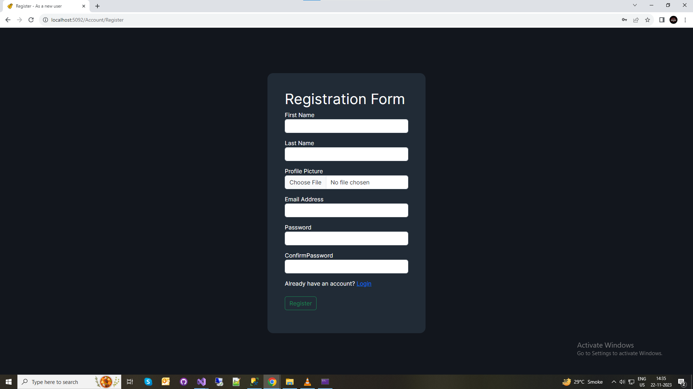
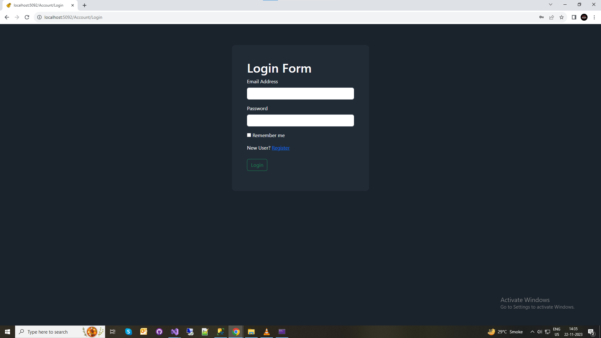
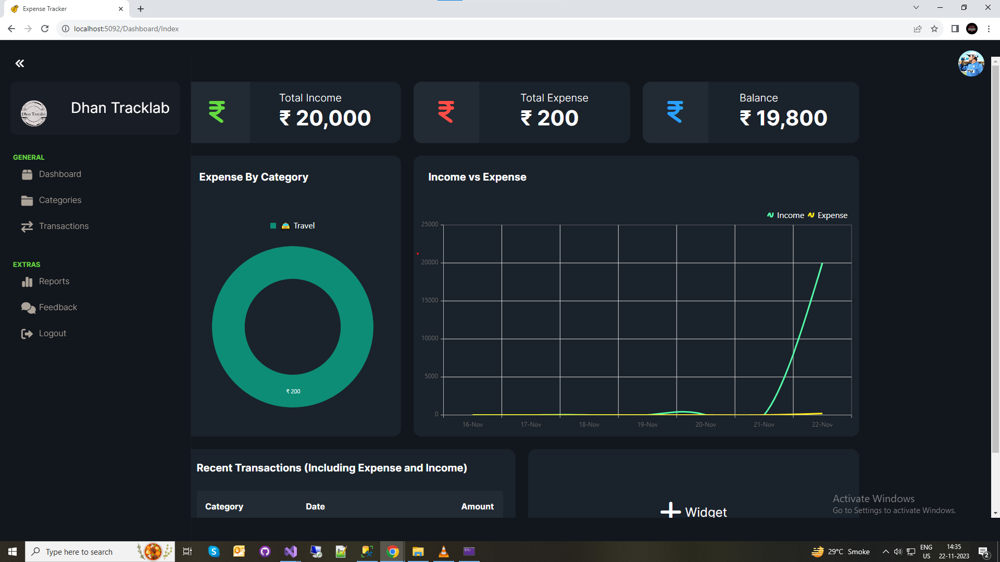
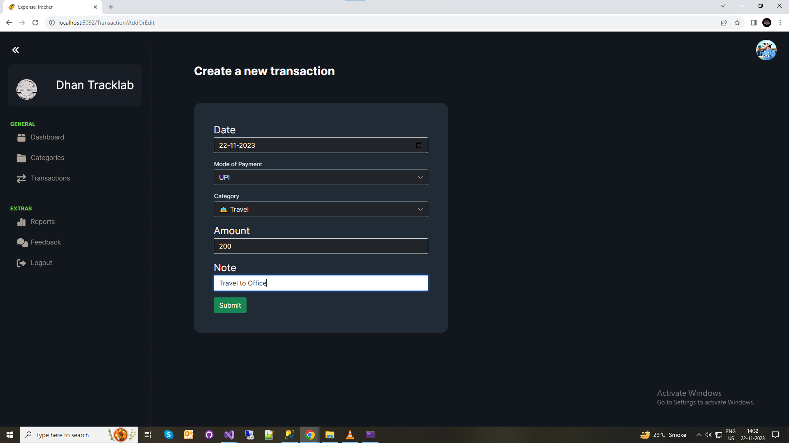
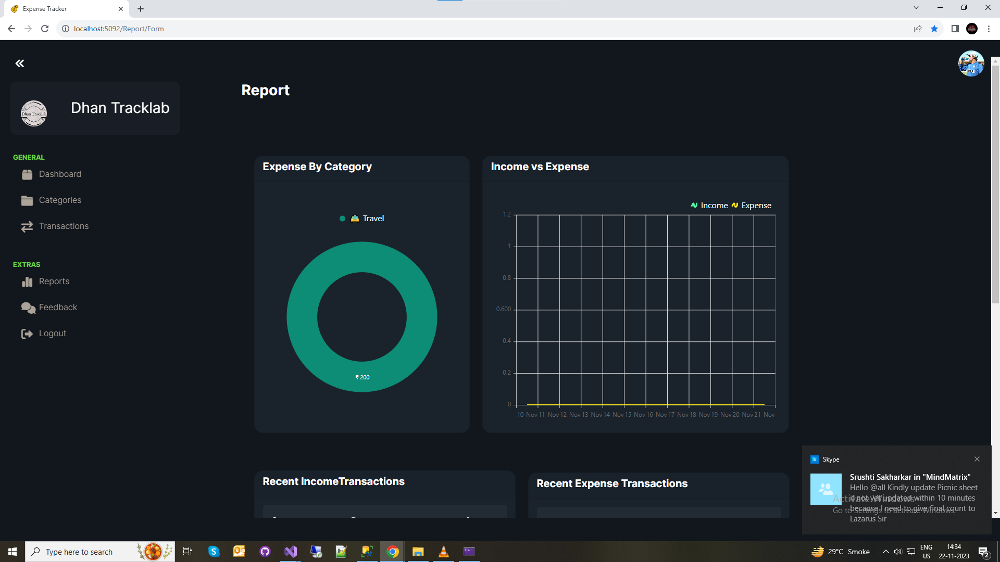
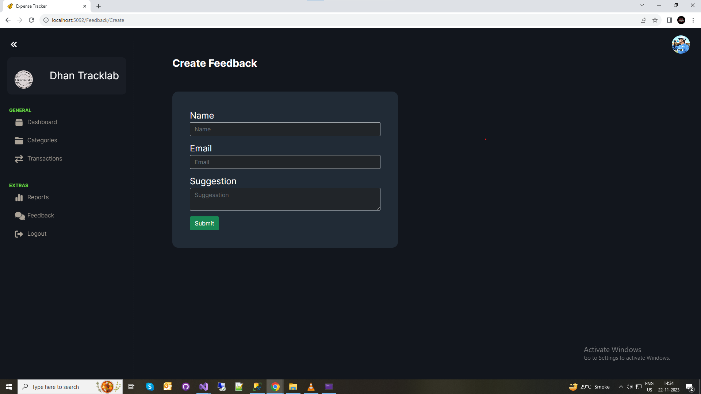

# Expense Tracker
Expense Tracker is a web-based application built using the ASP.NET MVC framework, designed to help users manage and track their expenses efficiently. The application provides a user-friendly interface for adding, categorizing, and analyzing expenses.

## 2. Features

- **User Authentication**: Secure user authentication system to ensure data privacy.
- **Dashboard**: Personalized dashboard for each user with quick access to key features.
- **Expense Management**: Add, edit, and delete expenses with details such as amount, date, and category.
- **Income Management**: Track income transactions for a comprehensive financial overview.
- **Category Management**: Create, edit, and delete expense and income categories for better organization.
- **Transaction Management**: Easily create new transactions and associate them with specific categories.
- **Reporting**: Generate and view expense and income reports based on different criteria like date range or category.
- **Feedback**: Provide feedback on the application for continuous improvement.
- **Logout**: Securely log out from the application.

## 3. System Requirements

- **Operating System**: Windows, Linux, or macOS
- **.NET Runtime**: .NET Core 3.1 or later
- **Web Browser**: Latest versions of Chrome, Firefox, or Edge

## 2. Features

### User Authentication

- Secure user authentication system to ensure data privacy.

### Dashboard

- Personalized dashboard for each user with quick access to key features.

### Category Management

.png)
.png)

- Create, edit, and delete expense and income categories for better organization.

### Transaction Management

- Easily create new transactions and associate them with specific categories.

### Reporting

- Generate and view expense and income reports based on different criteria like date range or category.

### Feedback

- Provide feedback on the application for continuous improvement.

